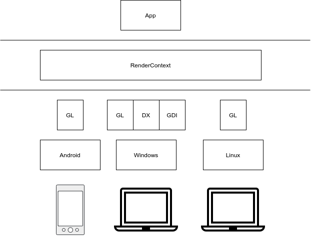
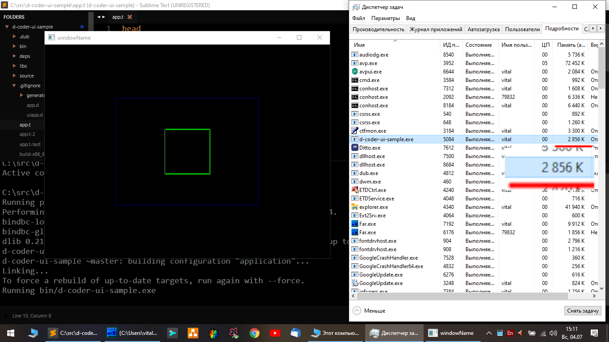

# d-coder-ui
Native D language UI. Windows/Linux( planned )/Android( planned )

Example: [https://github.com/vitalfadeev/d-coder-ui-sample](https://github.com/vitalfadeev/d-coder-ui-sample)

Radmap: [roadmap.md](roadmap.md)

## Details

### Main idea

Take UI definition, convert to native D code, then D code compile to binary.

Next UI definition
__app.t__
```
style
  stage
    border: 3px solid #003
    width:  100px
    height: 100px

    on: WM_LBUTTONDOWN
        ~selected

  dark
    border: 2px solid #008
    width:  50px
    height: 50px

  intro
    border: 1px solid #00C
    width:  10px
    height: 10px

  selected
    border: 1px solid #0C0

body stage
  e stage dark
  e stage intro

```

will be compilled to the next source code:
source/generated/__style.d__
```
// style.d
module generated.style;


import ui;

struct stage
{
    string name = "stage";
    
    static
    void setter( Element* element )
    {
        with ( element.computed )
        {
            borderWidth = (3.000000).px;
            borderStyle = LineStyle.solid;
            borderColor = Color( 0x0, 0x0, 0x30 );
            width = (100.000000).px;
            height = (100.000000).px;
        }
    }
    
    static
    void on( Element* element, Event* event )
    {
        switch ( event.type )
        {
            case WM_KEYDOWN: on_WM_KEYDOWN( element, event ); break;
            case WM_LBUTTONDOWN: on_WM_LBUTTONDOWN( element, event ); break;
            default:
        }
    }
    
    static
    void on_WM_KEYDOWN( Element* element, Event* event )
    {
        if ( event.arg1 == VK_SPACE )
        with ( element )
        {
            //     on: WM_KEYDOWN VK_SPACE
            toggleClass( "selected" );
            return;
        }
    }
    
    static
    void on_WM_LBUTTONDOWN( Element* element, Event* event )
    {
        with ( element )
        {
            //     on: WM_LBUTTONDOWN
            toggleClass( "selected" );
            return;
        }
        
    }
    

}

struct dark
{
    string name = "dark";
    
    static
    void setter( Element* element )
    {
        with ( element.computed )
        {
            borderWidth = (2.000000).px;
            borderStyle = LineStyle.solid;
            borderColor = Color( 0x0, 0x0, 0x80 );
            width = (50.000000).px;
            height = (50.000000).px;
        }
    }
    
}

struct intro
{
    string name = "intro";
    
    static
    void setter( Element* element )
    {
        with ( element.computed )
        {
            borderWidth = (1.000000).px;
            borderStyle = LineStyle.solid;
            borderColor = Color( 0x0, 0x0, 0xC0 );
            width = (10.000000).px;
            height = (10.000000).px;
        }
    }
    
}

struct selected
{
    string name = "selected";
    
    static
    void setter( Element* element )
    {
        with ( element.computed )
        {
            borderWidth = (1.000000).px;
            borderStyle = LineStyle.solid;
            borderColor = Color( 0x0, 0xC0, 0x0 );
        }
    }
    
}

static
this()
{
    registerClass!stage();
    registerClass!dark();
    registerClass!intro();
    registerClass!selected();
}
```

source/generated/__tree.d__
```
// tree.d
module generated.tree;


import ui;
import generated.style;

void initUI( Document* document )
{
  Element* element;
  Element* parentElement;
  
  // body 
  document.body.addClass!stage;
  
    // e
    element = document.createElement( "e" );
    element.addClass!stage;
    element.addClass!dark;
    document.body.appendChild( element );
        
    // e
    element = document.createElement( "e" );
    element.addClass!stage;
    element.addClass!intro;
    document.body.appendChild( element );
}
```

source/generated/__package.d__
```
// package.d
module generated;

public import generated.style;
public import generated.tree;
```

### Example 

Next code is simple application:
source/__app.d__
```
// app.d
import std.stdio;
import ui;
import ui.oswindow : OSWindow;


bool doLoop = true;


void main()
{
    UI();
    eventLoop();
}


void UI()
{
    import generated : initUI;

    auto document = new Document;

    initUI( document );

    auto window = new OSWindow( document );
}


/** */
void eventLoop()
{
    import core.sys.windows.windows;

    MSG msg;

   while ( doLoop && GetMessage( &msg, NULL, 0, 0 ) )
   {
       //TranslateMessage( &msg );
       DispatchMessage( &msg );
   }
}
```

### Building with dub
For build with dub append two keywords in dub.json:
```
    "dependencies":
    {
        "d-coder-ui" : { "path" : "deps/d-coder-ui" }
    },
    "preGenerateCommands":
    [
         "start /wait cmd /C IF EXIST source\\generated rmdir /q /s source\\generated",
         "start /wait deps/d-coder-ui-tools/bin/t-convertor.exe"
    ]
```

## Tech Inside
app.t -> source/generated/... .d

### Style, Classes
```
style
  stage
    width:  100px
    height: 100px
```
converted to
```
struct stage
{
    string name = "stage";
    
    static
    void setter( Element* element )
    {
        with ( element.computed )
        {
            width = (100.000000).px;
            height = (100.000000).px;
        }
    }
}
```

### Event handlers

```
style
  stage
    on: WM_LBUTTONDOWN
        ~selected
```
converted to 
```
struct stage
{
    static
    void on( Element* element, Event* event )
    {
        switch ( event.type )
        {
            case WM_LBUTTONDOWN: on_WM_LBUTTONDOWN( element, event ); break;
            default:
        }
    }
    
    static
    void on_WM_LBUTTONDOWN( Element* element, Event* event )
    {
        with ( element )
        {
            toggleClass( "selected" );
            return;
        }
        
    }
}
```

### Document tree
```
body stage
  e stage intro
```
converted to 
```
  // body 
  document.body.addClass!stage;

    // e
    element = document.createElement( "e" );
    element.addClass!stage;
    element.addClass!intro;
    document.body.appendChild( element );    
```

### Element
Concept is:

#### Element classes
Element contains classes
```
// Element
//   classes
//     [ e, stage, intro ]  // classes

struct Element
{
    ClassList classes;
}
```

#### Element computed properties
Element read each class and compute properties for drawing
```
// Element
//   computed               // properties for draw element
//     width
//     height
//     border
//       width
//       style
//       color
//     color
//     background

struct Element 
{
    Computed computed;
}
```

#### Classes
Class has "setter" for set properies
```
// Class
//   setter():
//     set width
//     set height
//     set color

struct Class
{
    void setter( Element* element )
    {
        with ( element.computed )
        {
            width  = 100.px;
            height = 100.px;
        }
    }
}
```

#### Units
Properties has units, like a CSS
```
// width: 1px
width = 1.px;
```

### Render



### Demo





