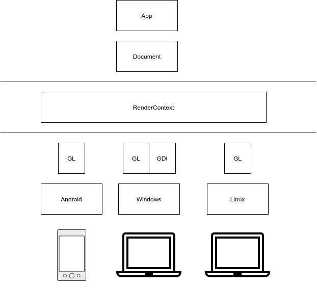

# d-coder-ui


D language GUI. 

Goals:
- native
- fast
- low RAM usage
- Windows / Linux / Android ( planned )
- CSS
- human-readable markup
- GDI / OpenGL / GLES
- API like Chrome / Firefox
- JS / jQuery selectors
- event handlers on D language


Example: [https://github.com/vitalfadeev/d-coder-ui-sample](https://github.com/vitalfadeev/d-coder-ui-sample)

Radmap: [roadmap.md](roadmap.md)

Support: [https://www.patreon.com/dgui](https://www.patreon.com/dgui)


## Details

### Render



### Demo


### Memory usage


### Document


### Element


### Tree

```T
body
    e image
    e input roof
    e input angle
    e input wide

image
    width:    640px
    height:   540px
    position: absolute
    image:    docs/roof.png

input
    width: 120px
    height: 40px

roof
    disabled: true
    left: 486px
    top:  151px
    position: absolute

angle
    text: 60
    left: 486px
    top:  289px
    position: absolute

    on: changed
    {
        calculate();
    }

wide
    text: 2.50
    left: 198px
    top:  459px
    position: absolute

    on: changed
    {
        calculate();
    }

{
    void calculate()
    {
        // roof = wide / ( 2 * cos angle )

        import std.math : cos;

        auto wide  = S("wide" ).text.to!float;
        auto angle = S("angle").text.to!float;

        S("root").text = 
            wide / ( 2 * cos( angle / 180 * PI ) );
    }
}
```

#### Element computed properties

Element read each class and compute properties for drawing

```D
// Element
//   width
//   height
//   color
//   background
//
//   computed               // properties for drawing element
//     width
//     height
//     color
//     background

struct Element 
{
    CSSValue width;
    CSSValue height;
    CSSValue color;
    CSSValue background;

    Computed computed;
}
```

#### Classes

Class has "setter" for set properies

```D
// Class
//   setter():
//     set width
//     set height
//     set color

struct Class
{
    void setter( Element* element )
    {
        with ( element )
        {
            width  = 100.px;
            height = 100.px;
        }
    }
}
```

#### Units

Properties has units, like a CSS

```D
// width: 1px
width = 1.px;
```

